# ✦ github-profile-orbit

<p align="center">
  <strong>A data-driven celestial map of your open-source universe, generated entirely via GitHub Actions.</strong>
</p>

<p align="center">
  <a href="#quick-start">Quick Start</a> •
  <a href="#visual-showcase">Showcase</a> •
  <a href="#templates">Templates</a> •
  <a href="#configuration">Configuration</a> •
  <a href="#light-and-dark-mode">Light & Dark Mode</a> •
  <a href="#architecture">Architecture</a> •
  <a href="#local-development">Development</a>
</p>

---

## 🌌 Overview

**`github-profile-orbit`** transforms your GitHub profile data into a living, vector-rendered (SVG) cosmos. Rather than a flat collection of badges or raw metric cards, it treats your software repositories, languages, and activity as a connected celestial system:

* **Repositories** orbit as planetary bodies whose diameter reflects star count and activity velocity.
* **Technologies & Languages** form constellation filaments and orbital rings interconnecting related projects.
* **Commit Velocity** illuminates pulsar glows around active repositories.
* **Telemetry Counters** chart aggregate stargazers, annual commits, repository volume, and tech diversity.

The generated vector asset is **100% self-contained SVG**, requires **zero runtime or JavaScript in your README**, adapts **automatically to GitHub Dark and Light themes**, and updates daily on an automated GitHub Actions schedule with change-detection (no unnecessary commits).

---

## 🔭 Visual Showcase

### 1. `space` (Flagship Cosmic Orbit)
*Concentric gravitational orbits where repositories circle your central identity, linked by shared language constellations.*

<p align="center">
  <picture>
    <source media="(prefers-color-scheme: dark)" srcset="examples/space-dark.svg">
    <source media="(prefers-color-scheme: light)" srcset="examples/space-light.svg">
    
  </picture>
</p>

### 2. `landscape` (Architectural Radar & System Composition)
*Data-oriented technical matrix detailing language telemetry bars, domain tags, and structured repository telemetry cards.*

<p align="center">
  <picture>
    <source media="(prefers-color-scheme: dark)" srcset="examples/landscape-dark.svg">
    <source media="(prefers-color-scheme: light)" srcset="examples/landscape-light.svg">
    
  </picture>
</p>

### 3. `network` (Technology Constellation Graph)
*Network topology highlighting primary language hubs and satellite repository nodes connected by multi-language filaments.*

<p align="center">
  <picture>
    <source media="(prefers-color-scheme: dark)" srcset="examples/network-dark.svg">
    <source media="(prefers-color-scheme: light)" srcset="examples/network-light.svg">
    
  </picture>
</p>

### 4. `minimal` (Executive Telemetry Summary)
*Ultra-clean, compact scorecard with high-contrast metric pills, language spectrum breakdown, and flagship project cards.*

<p align="center">
  <picture>
    <source media="(prefers-color-scheme: dark)" srcset="examples/minimal-dark.svg">
    <source media="(prefers-color-scheme: light)" srcset="examples/minimal-light.svg">
    
  </picture>
</p>

---

## 🚀 Quick Start

### 1. Create the Workflow File

In your profile repository (e.g. `your-username/your-username`), create `.github/workflows/github-profile-orbit.yml`:

```yaml
name: Update GitHub Ecosystem

on:
  schedule:
    - cron: '0 0 * * *' # Every day at 00:00 UTC
  workflow_dispatch:      # Allows manual one-click updates

permissions:
  contents: write         # Needed to commit generated SVG back to repository

jobs:
  visualize:
    runs-on: ubuntu-latest
    timeout-minutes: 5

    steps:
      - name: Checkout
        uses: actions/checkout@v4

      - name: Generate Cosmos
        uses: NiconiKimg/github-profile-orbit@v1
        with:
          username: ${{ github.repository_owner }}
          token: ${{ secrets.GITHUB_TOKEN }}
          template: space
          theme: auto
          output_path: dist/github-cosmos.svg
```

### 2. Embed into your Profile `README.md`

#### Option A: Zero-Config Auto Theme (Single Responsive SVG)
Because `github-profile-orbit` embeds `@media (prefers-color-scheme)` directly into the SVG, a single image automatically switches between light and dark modes:

```markdown

```

#### Option B: GitHub Markdown `<picture>` Element
For granular control or if generating explicit dual files:

```html
<picture>
  <source media="(prefers-color-scheme: dark)" srcset="dist/github-cosmos-dark.svg">
  <source media="(prefers-color-scheme: light)" srcset="dist/github-cosmos-light.svg">
  
</picture>
```

---

## ⚙️ Configuration Reference

All inputs are configured in the `with:` block of the Action:

| Input | Description | Default |
| :--- | :--- | :--- |
| `username` | GitHub username to visualize. | `${{ github.repository_owner }}` |
| `token` | GitHub token with GraphQL read permission. | `${{ github.token }}` |
| `template` | Visualization style: `space`, `landscape`, `network`, or `minimal`. | `space` |
| `theme` | Palette mode: `auto`, `dark`, or `light`. | `auto` |
| `role` | Custom professional title/role override (e.g. `Senior Full-Stack Engineer`). | *Auto-detected* |
| `output_path` | Destination path for primary generated SVG. | `dist/github-cosmos.svg` |
| `output_dark_path` | Optional path to generate explicit dark mode SVG. | *None* |
| `output_light_path` | Optional path to generate explicit light mode SVG. | *None* |
| `exclude_repositories` | Repository names/patterns to exclude (supports wildcards, e.g. `*-test`). | *None* |
| `include_repositories` | Whitelist of repositories to include. | *None* |
| `external_repositories` | External/transferred repositories to include with authorship weighting (e.g. `org/repo` or full URL). | *None* |
| `include_forks` | Include forked repositories. | `false` |
| `include_archived` | Include archived repositories. | `false` |
| `max_repositories` | Max number of prominent repositories to display. | `25` (capped at 10 in Space) |
| `show_header` | Whether to display the top identity and metrics header. | `true` |
| `show_footer` | Whether to display the bottom language spectrum bar and watermark. | `true` |
| `show_stats` | Show top telemetry pills (stars, commits, forks, languages). | `true` |
| `show_languages` | Show bottom language distribution bar and legend. | `true` |
| `show_activity` | Highlight recent activity with glowing pulsar rings. | `true` |
| `show_constellations` | Draw constellation filament lines between shared language repos. | `true` |
| `show_orbits` | Draw planetary orbit rings. | `true` |
| `show_animations` | Include animated elements (UFO scout, spaceship, satellite, comet). | `true` |
| `show_comet` | Toggle comet animation specifically. | `true` |
| `show_ufo` | Toggle UFO animation specifically. | `true` |
| `show_spaceship` | Toggle spaceship cruiser animation specifically. | `true` |
| `show_satellite` | Toggle telemetry satellite probe animation specifically. | `true` |
| `custom_title` | Custom header title string. | *None* |
| `auto_commit` | Automatically commit generated assets if changed. | `true` |
| `commit_message` | Git commit message. | `chore(docs): update GitHub ecosystem visualization [skip ci]` |

### Advanced Example

```yaml
- uses: NiconiKimg/github-profile-orbit@v1
  with:
    username: octocat
    token: ${{ secrets.GITHUB_TOKEN }}
    template: space
    theme: auto
    output_path: assets/cosmos.svg
    output_dark_path: assets/cosmos-dark.svg
    output_light_path: assets/cosmos-light.svg
    exclude_repositories: |
      dotfiles
      *-sandbox
      legacy-*
    include_forks: false
    include_archived: false
    max_repositories: 30
    custom_title: "Octocat's Software Cosmos"
    auto_commit: true
```

---

## 🛡️ Repository Filtering & Isolation

Repository security is guaranteed by design:

1. **Strict Public Isolation**: The GraphQL query is constrained to `privacy: PUBLIC`. Private repositories will **never** be retrieved or exposed in public SVGs.
2. **Pre-Analytics Filtering**: Excluded repositories are filtered out **before** calculating language percentages, commit totals, star counts, or cluster rankings. They exert zero influence on downstream visualization math.
3. **Wildcard & Glob Matching**:
   ```yaml
   exclude_repositories: |
     private-lab-*
     *-temp
     assignment-*
     my-secret-repo
   ```

---

## 🌓 Light & Dark Theme Design

Instead of a simple color inversion, `github-profile-orbit` uses two bespoke visual palettes:

* **Dark Mode ("Deep Cosmic Void")**: Deep obsidian backgrounds (`#080C16`), soft nebular glows, high-contrast typography, and glowing planetary auras.
* **Light Mode ("Celestial Cartography")**: Clean titanium / starchart background (`#F8FAFC`), subtle slate orbital lines, deep cobalt celestial nodes, and high-readability jewel accents.
* **Auto Mode**: Uses CSS variables controlled by `@media (prefers-color-scheme: light)` so GitHub switches the theme dynamically without page reloads.

---

## 🏛️ System Architecture

```text
GitHub GraphQL API (1 single query, 1 rate-limit point)
         ↓
  Data Acquisition (Octokit client with rate-limit and error guards)
         ↓
  Repository Filtering (Exclusions, wildcards, fork/archive rules)
         ↓
  Data Normalization (Conversion to NormalizedEcosystem data model)
         ↓
  Analytics & Scoring (Gravitational radius, orbit tier, activity velocity)
         ↓
  Visualization Engine (Space | Landscape | Network | Minimal)
         ↓
  Vector SVG Builder (Self-contained XML markup with CSS variables & filters)
         ↓
  Git Committer (SHA-256 diffing to prevent unnecessary commits)
```

---

## 💻 Local Development & CLI

### Prerequisites
* Node.js v20+
* `pnpm` (v10+)

### Setup
```bash
# Clone the repository
git clone https://github.com/github-profile-orbit/github-profile-orbit.git
cd github-profile-orbit

# Install dependencies
pnpm install

# Run test suite
pnpm test

# Generate preview showcase assets for all templates
pnpm run generate:examples
```

### CLI Generation with Mock or Live Data
```bash
# Generate specific template with synthetic mock data
pnpm exec tsx src/cli.ts --mock --username octocat --template space --theme dark

# Generate all template & theme variants into examples/
pnpm run generate:examples

# Build production bundle for GitHub Action
pnpm run build
```

---

## 🤝 Contributing

Contributions are warmly welcomed! Please open an issue to discuss proposed templates or optimizations before submitting a PR. Ensure that:
1. All unit tests pass: `pnpm test`
2. TypeScript compiles cleanly: `pnpm run typecheck`
3. The production bundle is rebuilt: `pnpm run build`

---

## 📄 License

Distributed under the [MIT License](LICENSE).
